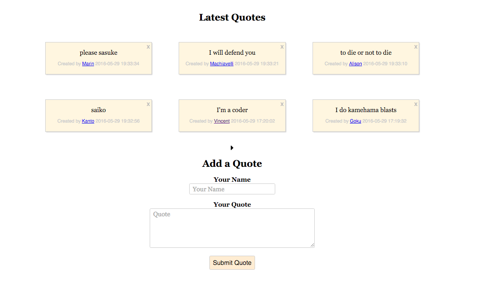

# QuotesApp
#
This app will essentially take quotes from users where the users can type the quotes and author for the quotes. Then the user can also filter based on the authorof the quotes, delete the quotes. Preliminary authentication, pagination for the quotes and validating messages will also be performed. All of the data will be stored in a mysql database onphpmyadmin running on an apache server. T 

